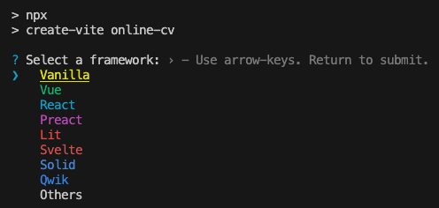
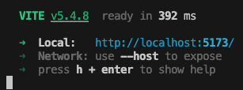

### Installasjon
<details>
<summary>Installere og kjøre React</summary>

1. **Sjekk om Node.js er installert**  
    Mange brukere vil allerede ha Node.js og npm (Node Package Manager) installert på sin maskin. For å sjekke om de er installert, åpne terminalen eller kommandolinjen og kjør følgende kommandoer:
    ```bash
    node -v
    npm -v
    ```
    Hvis Node.js og npm er installert, skal du se versjonsnumrene for begge verktøyene, for eksempel:
    ```bash
    v16.13.0
    8.1.0
    ```

2. **Installer Node.js hvis det ikke er installert**  
     Hvis du ikke ser versjonsnumrene, må du installere Node.js. Gå til [Node.js sin offisielle nettside](https://nodejs.org/en) og last ned den nyeste versjonen.

### Opprett et nytt React-prosjekt

1. **Opprett prosjektet**  
     For å opprette et nytt React-prosjekt med Vite, kjør følgende kommando i terminalen:
     ```bash
     npm create vite@latest online-cv
     ```

     Du vil da se et skjermbilde som dette:

     

     Velg `React`, og deretter `Javascript`. Dette vil opprette en ny mappe kalt `online-cv` med alle nødvendige filer og avhengigheter for et React-prosjekt som bruker Javascript.

2. **Naviger til prosjektmappen**  
     Gå inn i prosjektmappen ved å kjøre:
     ```bash
     cd online-cv
     ```

3. **Installer avhengigheter**  
     Installer nødvendige avhengigheter ved å kjøre:
     ```bash
     npm install
     ```

4. **Start prosjektet**  
     Start utviklingsserveren ved å kjøre:
     
     ```bash
     npm run dev
     ```

     Du bør nå få opp følgende skjermbilde

     
     
     hvor man i dette tilfellet ser at serveren kjører på port `5173`. 

</details>