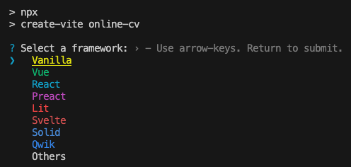
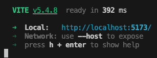

# Oppgavesett: Interaktiv Online CV Webapplikasjon\n
## Innføring i introduksjon til `React`

### Oppgave 1: Installasjon

1. **Sjekk om Node.js er installert**  
   Mange brukere vil allerede ha Node.js og npm (Node Package Manager) installert på sin maskin. For å sjekke om de er installert, åpne terminalen eller kommandolinjen og kjør følgende kommandoer:
   ```bash
   node -v
   npm -v
   ```
   Hvis Node.js og npm er installert, skal du se versjonsnumrene for begge verktøyene, for eksempel:
   ```bash
   v16.13.0
   8.1.0
   ```

> [!NOTE]  
> Hvis de ikke er installert vil du få `command not found`. 

2. **Installer Node.js hvis det ikke er installert**  
    Hvis du ikke ser versjonsnumrene, må du installere Node.js. Gå til [Node.js sin offisielle nettside](https://nodejs.org/en) og last ned den nyeste versjonen.

### Oppgave 2: Opprett et nytt React-prosjekt

1. **Opprett prosjektet**  
    For å opprette et nytt React-prosjekt med Vite, kjør følgende kommando i terminalen:
    ```bash
    npm create vite@latest online-cv
    ```

    Du vil da se et skjermbilde som dette:

    

> [!IMPORTANT]  
> Velg `React`, og deretter `Javascript`.

    Dette vil opprette en ny mappe kalt `online-cv` med alle nødvendige filer og avhengigheter for et React-prosjekt som bruker Javascript.

2. **Naviger til prosjektmappen**  
    Gå inn i prosjektmappen ved å kjøre:
    ```bash
    cd online-cv
    ```

3. **Installer avhengigheter**  
    Installer nødvendige avhengigheter ved å kjøre:
    ```bash
    npm install
    ```

4. **Start prosjektet**  
    Start utviklingsserveren ved å kjøre:
    
    ```bash
    npm run dev
    ```

    Du bør nå få opp følgende skjermbilde

    
    
    hvor man i dette tilfellet ser at serveren kjører på port `5173`. 

### Oppgave 3: Grunnleggende Struktur

Når du bruker `npm create vite`-kommandoen for å opprette et nytt prosjekt, vil du se følgende filer og mapper:

- `App.css`: Denne filen inneholder stilarkene for `App`-komponenten. Du kan bruke denne filen til å legge til CSS-stiler som gjelder for hele applikasjonen.
- `App.jsx`: Dette er hovedkomponenten i React-applikasjonen din. Her vil du definere strukturen og logikken for applikasjonen.
- `assets`: Denne mappen inneholder statiske ressurser som bilder og andre medier som brukes i applikasjonen.
- `index.css`: Denne filen inneholder globale CSS-stiler som gjelder for hele applikasjonen. Du kan bruke denne filen til å definere grunnleggende stiler som gjelder for alle komponenter.
- `main.jsx`: Dette er inngangspunktet for React-applikasjonen din. Her importeres hovedkomponenten (`App`) og renderes til DOM-en.

1. **Fjern standardkode**  
    Åpne `App.jsx` i en teksteditor og fjern all kode.

2. **Legg til en overskrift**  
    Legg til følgende kode i `App.jsx` for å vise en overskrift:
    ```jsx
    function App() {
      return (
         <div>
            <h1>Mitt Online CV</h1>
         </div>
      );
    }
    export default App;
    ```
3. **Legg til et bilde**  
   Under overskriften, legg til et bilde av deg selv - i dette eksempelet brukes `reactLogo` som bilde. 

   ```diff
   +import reactLogo from "./assets/react.svg"
   +
   function App() {
      return (
         <div>
         <h1>Mitt Online CV</h1>
   +        
         </div>
      );
   }
   ```

   <details>
   <summary>Se full kode</summary>

   ```jsx
   import reactLogo from "./assets/react.svg";

   function App() {
      return (
         <div>
            <h1>Mitt Online CV</h1>
            
         </div>
      );
   }
   export default App;
   ```

   </details>

   I denne koden importerer vi et bilde (`reactLogo`) fra `./assets`-mappen og bruker det i en ``-tag. `src`-attributtet til ``-taggen peker på bildet vi importerte, og `alt`-attributtet gir en beskrivelse av bildet som vises hvis bildet ikke kan lastes. `className`-attributtet brukes til å legge til CSS-klasser for styling av bildet.

4. **Legg til grunnleggende informasjon**  
   Legg til informasjon som navn, adresse, telefonnummer og e-post:

   ```diff
     function App() {
       <div>
         <h1>Mitt Online CV</h1>
         
   +        <p>Navn: [Ditt Navn]</p>
   +        <p>Adresse: [Din Adresse]</p>
   +        <p>Telefonnummer: [Ditt Telefonnummer]</p>
   +        <p>E-post: [Din E-post]</p>
       </div>
     );
   }
   ```

   <details>
   <summary>Se full kode</summary>

   ```jsx
   function App() {
   return (
      <div>
         <h1>Mitt Online CV</h1>
         
         <p>Navn: [Ditt Navn]</p>
         <p>Adresse: [Din Adresse]</p>
         <p>Telefonnummer: [Ditt Telefonnummer]</p>
         <p>E-post: [Din E-post]</p>
      </div>
   );
   }
   ```
   </details>

### Oppgave 4: Interaktivitet

1. **Legg til en knapp**  
    Legg til en knapp under din informasjon med teksten 'Vis detaljer':
    ```jsx
    function App() {
      const visDetaljer = () => {
         alert('Ferdigheter: HTML, CSS, JavaScript, React');
      };

      return (
         <div>
            <h1>Mitt Online CV</h1>
            
            <p>Navn: [Ditt Navn]</p>
            <p>Adresse: [Din Adresse]</p>
            <p>Telefonnummer: [Ditt Telefonnummer]</p>
            <p>E-post: [Din E-post]</p>
            <button onClick={visDetaljer}>Vis detaljer</button>
         </div>
      );
    }
    ```

### Utfordringsoppgave 1: Komponenter

1. **Splitt applikasjonen i komponenter**  
    Opprett tre separate komponenter: `Header`, `PersonalInfo` og `SkillsButton`.

2. **Header-komponenten**  
    Opprett en ny fil `Header.jsx`:
    ```jsx
    function Header() {
      return (
         <div>
            <h1>Mitt Online CV</h1>
            
         </div>
      );
    }
    export default Header;
    ```

3. **PersonalInfo-komponenten**  
    Opprett en ny fil `PersonalInfo.jsx`:
    ```jsx
    function PersonalInfo() {
      return (
         <div>
            <p>Navn: [Ditt Navn]</p>
            <p>Adresse: [Din Adresse]</p>
            <p>Telefonnummer: [Ditt Telefonnummer]</p>
            <p>E-post: [Din E-post]</p>
         </div>
      );
    }
    export default PersonalInfo;
    ```

4. **SkillsButton-komponenten**  
    Opprett en ny fil `SkillsButton.jsx`:
    ```jsx
    function SkillsButton() {
      const visDetaljer = () => {
         alert('Ferdigheter: HTML, CSS, JavaScript, React');
      };

      return (
         <button onClick={visDetaljer}>Vis detaljer</button>
      );
    }
    export default SkillsButton;
    ```

5. **Bruk komponentene i `App.jsx`**  
    Oppdater `App.jsx` til å bruke de nye komponentene:
    ```jsx
    import Header from './Header';
    import PersonalInfo from './PersonalInfo';
    import SkillsButton from './SkillsButton';

    function App() {
      return (
         <div>
            <Header />
            <PersonalInfo />
            <SkillsButton />
         </div>
      );
    }
    export default App;
    ```

### Utfordringsoppgave 2: Props

1. **Overfør data med props**  
    Oppdater `PersonalInfo` til å motta data som props:
    ```jsx
    function PersonalInfo({ navn, adresse, telefonnummer, epost }) {
      return (
         <div>
            <p>Navn: {navn}</p>
            <p>Adresse: {adresse}</p>
            <p>Telefonnummer: {telefonnummer}</p>
            <p>E-post: {epost}</p>
         </div>
      );
    }
    export default PersonalInfo;
    ```

2. **Send props fra `App.jsx`**  
    Oppdater `App.jsx` til å sende props til `PersonalInfo`:
    ```jsx
    import Header from './Header';
    import PersonalInfo from './PersonalInfo';
    import SkillsButton from './SkillsButton';

    function App() {
      return (
         <div>
            <Header />
            <PersonalInfo 
              navn="[Ditt Navn]" 
              adresse="[Din Adresse]" 
              telefonnummer="[Ditt Telefonnummer]" 
              epost="[Din E-post]" 
            />
            <SkillsButton />
         </div>
      );
    }
    export default App;
    ```


## Innføring i `Components` & `Props` i React

### Oppgave 1: Oppsett av Prosjektstruktur

> [!NOTE]  
> For å holde prosjektet organisert, skal vi opprette en mappe kalt `components` i prosjektets rotkatalog. Denne mappen vil inneholde alle våre React-komponenter. Å ha en dedikert mappe for komponenter gjør det enklere å vedlikeholde og navigere i prosjektet.

1. **Opprett en `components` mappe**  

   ```bash
   mkdir components
   ```

### Oppgave 2: Komponenter og Props

1. **Opprett en ny komponent `Education`**  
   Lag en ny fil `components/Education.jsx` som tar inn props `school` og `degree`. Komponenten skal returnere en div med to paragrafer for henholdsvis `school` og `degree`:

   ```jsx
   // components/Education.jsx
   function Education({ school, degree }) {
     return (
       <div>
         <p>Skole: {school}</p>
         <p>Grad: {degree}</p>
       </div>
     );
   }
   export default Education;
   ```

> [!TIP]
> Husk å eksportere komponenten slik at den kan importeres i andre filer.

   **Inkluder `Education` i `App`**  
   Oppdater `App.jsx` til å inkludere `Education` komponenten:

   ```jsx
   // App.jsx
   import React from 'react';
   import Education from './components/Education';

   function App() {
     return (
       <div>
         <h1>Min App</h1>
         <Education school="MIT" degree="Bachelor of Science" />
       </div>
     );
   }

   export default App;
   ```

### Oppgave 3: Hendelser og Håndtering

1. **Opprett en ny komponent `Skills`**  
   Lag en ny fil `components/Skills.jsx` som tar inn en liste av ferdigheter som props. Komponenten skal vise en knapp som, når klikket, viser ferdighetene i en alert:

   ```jsx
   // components/Skills.jsx
   function Skills({ skills }) {
     const visFerdigheter = () => {
       alert(`Ferdigheter: ${skills.join(', ')}`);
     };

     return (
       <button onClick={visFerdigheter}>Vis ferdigheter</button>
     );
   }
   export default Skills;
   ```

   **Inkluder `Skills` i `App`**  
   Oppdater `App.jsx` til å inkludere `Skills` komponenten:

   ```diff
   import React from 'react';
   import Education from './components/Education';
   +import Skills from './components/Skills';
   
   function App() {
      return (
   +    <div>
         <h1>Min App</h1>
         <Education school="MIT" degree="Bachelor of Science" />
   +      <Skills skills={['JavaScript', 'React', 'Node.js']} />
      </div>
      );
   }
   ```

   <details>
   <summary>Se full kode</summary>

   ```jsx
   // App.jsx
   import React from 'react';
   import Education from './components/Education';
   import Skills from './components/Skills';

   function App() {
     return (
       <div>
         <h1>Min App</h1>
         <Education school="MIT" degree="Bachelor of Science" />
         <Skills skills={['JavaScript', 'React', 'Node.js']} />
       </div>
     );
   }

   export default App;
   ```
   </details>

### Oppgave 4: Komponent Sammensetning

1. **Opprett en `Footer` komponent**  
   Lag en ny fil `components/Footer.jsx` som tar inn prop `year`. Komponenten skal returnere en div som viser © {year} Ditt Navn:

   ```jsx
   // components/Footer.jsx
   function Footer({ year }) {
     return (
       <div>
         © {year} Ditt Navn
       </div>
     );
   }
   export default Footer;
   ```

   **Inkluder `Footer` i `App`**  
   Oppdater `App.jsx` til å inkludere `Footer` komponenten:

   ```diff
   import React from 'react';
   import Education from './components/Education';
   import Skills from './components/Skills';
   +import Footer from './components/Footer';
   
   function App() {
      return (
   @@ -9,6 +10,7 @@ function App() {
         <h1>Min App</h1>
         <Education school="MIT" degree="Bachelor of Science" />
         <Skills skills={['JavaScript', 'React', 'Node.js']} />
   +      <Footer year={2024} />
      </div>
      );
   }
   ```

   <details>
   <summary>Se full kode</summary>

   ```jsx
   // App.jsx
   import React from 'react';
   import Education from './components/Education';
   import Skills from './components/Skills';
   import Footer from './components/Footer';

   function App() {
     return (
       <div>
         <h1>Min App</h1>
         <Education school="MIT" degree="Bachelor of Science" />
         <Skills skills={['JavaScript', 'React', 'Node.js']} />
         <Footer year={2024} />
       </div>
     );
   }

   export default App;
   ```
   </details>

### Oppgave 5: Props og Hendelser

1. **Modifiser `Skills` komponenten**  
   Oppdater `Skills` komponenten til å ta inn en ekstra prop `onSkillClick`. Komponenten skal vise en liste over ferdigheter som knapper, og når en knapp klikkes, skal `onSkillClick` funksjonen kalles med ferdigheten som argument:

   ```diff
   -function Skills({ skills }) {
   -    const visFerdigheter = () => {
   -      alert(`Ferdigheter: ${skills.join(', ')}`);
   -    };
   -  
   +function Skills({ skills, onSkillClick }) {
      return (
   -      <button onClick={visFerdigheter}>Vis ferdigheter</button>
   +      <div>
   +        {skills.map((skill, index) => (
   +          <button key={index} onClick={() => onSkillClick(skill)}>
   +            {skill}
   +          </button>
   +        ))}
   +      </div>
      );
      }
   ```

   <details>
   <summary>Se full kode</summary>

   ```jsx
   // components/Skills.jsx
   function Skills({ skills, onSkillClick }) {
     return (
       <div>
         {skills.map((skill, index) => (
           <button key={index} onClick={() => onSkillClick(skill)}>
             {skill}
           </button>
         ))}
       </div>
     );
   }
   export default Skills;
   ```

   </details>

   <br></br>

   **Inkluder oppdatert `Skills` i `App`**  
   Oppdater `App.jsx` til å inkludere den oppdaterte `Skills` komponenten:

   ```diff
   function App() {
   +  const handleSkillClick = (skill) => {
   +    alert(`Du klikket på: ${skill}`);
   +  };
   +
      return (
      <div>
         <h1>Min App</h1>
         <Education school="MIT" degree="Bachelor of Science" />
   -      <Skills skills={['JavaScript', 'React', 'Node.js']} />
   +      <Skills skills={['JavaScript', 'React', 'Node.js']} onSkillClick={handleSkillClick} />
         <Footer year={2024} />
      </div>
      );
   ```

   <details>
   <summary>Se full kode</summary>

   ```jsx
   // App.jsx
   import React from 'react';
   import Education from './components/Education';
   import Skills from './components/Skills';
   import Footer from './components/Footer';

   function App() {
     const handleSkillClick = (skill) => {
       alert(`Du klikket på: ${skill}`);
     };

     return (
       <div>
         <h1>Min App</h1>
         <Education school="MIT" degree="Bachelor of Science" />
         <Skills skills={['JavaScript', 'React', 'Node.js']} onSkillClick={handleSkillClick} />
         <Footer year={2024} />
       </div>
     );
   }

   export default App;
   ```

   </details>

### Ekstra utfordringsoppgaver

1. **Opprett en `Projects` komponent**  
   Lag en ny fil `components/Projects.jsx` som tar inn en liste av prosjekter som props. Komponenten skal vise prosjektene med tittel, beskrivelse og en lenke:

   ```jsx
   // components/Projects.jsx
   function Projects({ projects }) {
     return (
       <div>
         {projects.map((project, index) => (
           <div key={index}>
             <h3>{project.title}</h3>
             <p>{project.description}</p>
             <a href={project.link} target="_blank" rel="noopener noreferrer">
               Se prosjekt
             </a>
           </div>
         ))}
       </div>
     );
   }
   export default Projects;
   ```

   **Inkluder `Projects` i `App`**  
   Oppdater `App.jsx` til å inkludere `Projects` komponenten:

   ```diff
   import Education from './components/Education';
   import Skills from './components/Skills';
   import Footer from './components/Footer';
   +import Projects from './components/Projects';
   
   function App() {
      const handleSkillClick = (skill) => {
      alert(`Du klikket på: ${skill}`);
      };
   
   +  const projects = [
   +    { title: 'Prosjekt 1', description: 'Beskrivelse av prosjekt 1', link: 'http://example.com' },
   +    { title: 'Prosjekt 2', description: 'Beskrivelse av prosjekt 2', link: 'http://example.com' },
   +  ];
   +
      return (
      <div>
         <h1>Min App</h1>
         <Education school="MIT" degree="Bachelor of Science" />
         <Skills skills={['JavaScript', 'React', 'Node.js']} onSkillClick={handleSkillClick} />
   +      <Projects projects={projects} />
         <Footer year={2024} />
      </div>
      );
   ```

   <details>
   <summary>Se full kode</summary>

   ```jsx
   // App.jsx
   import React from 'react';
   import Education from './components/Education';
   import Skills from './components/Skills';
   import Footer from './components/Footer';
   import Projects from './components/Projects';

   function App() {
     const handleSkillClick = (skill) => {
       alert(`Du klikket på: ${skill}`);
     };

     const projects = [
       { title: 'Prosjekt 1', description: 'Beskrivelse av prosjekt 1', link: 'http://example.com' },
       { title: 'Prosjekt 2', description: 'Beskrivelse av prosjekt 2', link: 'http://example.com' },
     ];

     return (
       <div>
         <h1>Min App</h1>
         <Education school="MIT" degree="Bachelor of Science" />
         <Skills skills={['JavaScript', 'React', 'Node.js']} onSkillClick={handleSkillClick} />
         <Projects projects={projects} />
         <Footer year={2024} />
       </div>
     );
   }

   export default App;
   ```

   </details>

   <br></br>

2. **Endre `Skills` komponenten**  
   Oppdater `Skills` komponenten til å vise en liste over ferdigheter med en 'Slett' knapp. Når knappen klikkes, skal `onDeleteSkill` funksjonen kalles med indeksen til ferdigheten som argument:

   ```diff
   -function Skills({ skills, onSkillClick }) {
   +function Skills({ skills, onDeleteSkill }) {
      return (
         <div>
            {skills.map((skill, index) => (
   -          <button key={index} onClick={() => onSkillClick(skill)}>
   -            {skill}
   -          </button>
   +          <div key={index}>
   +            <span>{skill}</span>
   +            <button onClick={() => onDeleteSkill(index)}>Slett</button>
   +          </div>
            ))}
         </div>
      );
   ```

   <details>
   <summary>Se full kode</summary>

   ```jsx
   // components/Skills.jsx
   function Skills({ skills, onDeleteSkill }) {
     return (
       <div>
         {skills.map((skill, index) => (
           <div key={index}>
             <span>{skill}</span>
             <button onClick={() => onDeleteSkill(index)}>Slett</button>
           </div>
         ))}
       </div>
     );
   }
   export default Skills;
   ```

   </details>

   <br></br>

   **Inkluder oppdatert `Skills` i `App`**  
   Oppdater `App.jsx` til å inkludere den oppdaterte `Skills` komponenten:

   ```diff
   +import React, { useState } from 'react';
   import Education from './components/Education';
   import Skills from './components/Skills';
   import Footer from './components/Footer';
   import Projects from './components/Projects';
   
   function App() {
   +  const [skills, setSkills] = useState(['JavaScript', 'React', 'Node.js']);
   +
   -  const handleSkillClick = (skill) => {
   -  alert(`Du klikket på: ${skill}`);
   -  };
   
   +  const handleDeleteSkill = (index) => {
   +    setSkills(skills.filter((_, i) => i !== index));
   +  };
   +
      const projects = [
      { title: 'Prosjekt 1', description: 'Beskrivelse av prosjekt 1', link: 'http://example.com' },
      { title: 'Prosjekt 2', description: 'Beskrivelse av prosjekt 2', link: 'http://example.com' },
   @@ -19,7 +24,7 @@ function App() {
      <div>
         <h1>Min App</h1>
         <Education school="MIT" degree="Bachelor of Science" />
   -      <Skills skills={['JavaScript', 'React', 'Node.js']} onSkillClick={handleSkillClick} />
   +      <Skills skills={skills} onDeleteSkill={handleDeleteSkill} />
         <Projects projects={projects} />
         <Footer year={2024} />
      </div>
   ```

   <details>
   <summary>Se full kode</summary>

   ```jsx
   // App.jsx
   import React, { useState } from 'react';
   import Education from './components/Education';
   import Skills from './components/Skills';
   import Footer from './components/Footer';
   import Projects from './components/Projects';

   function App() {
     const [skills, setSkills] = useState(['JavaScript', 'React', 'Node.js']);

     const handleDeleteSkill = (index) => {
       setSkills(skills.filter((_, i) => i !== index));
     };

     const projects = [
       { title: 'Prosjekt 1', description: 'Beskrivelse av prosjekt 1', link: 'http://example.com' },
       { title: 'Prosjekt 2', description: 'Beskrivelse av prosjekt 2', link: 'http://example.com' },
     ];

     return (
       <div>
         <h1>Min App</h1>
         <Education school="MIT" degree="Bachelor of Science" />
         <Skills skills={skills} onDeleteSkill={handleDeleteSkill} />
         <Projects projects={projects} />
         <Footer year={2024} />
       </div>
     );
   }

   export default App;
   ```

   </details>


## Innføring i React `Hooks: useState`

### Oppgave 1: Vis CV-informasjon

I denne oppgaven skal du lage en seksjon i din CV-webapplikasjon hvor brukeren kan fylle inn sin grunnleggende informasjon: `Navn`, `Alder`, og `Yrke`. Vi bruker React sin `useState`-hook for å lagre og vise denne informasjonen. `useState` lar oss opprette tilstandsvariabler som kan endres og oppdateres når brukeren skriver inn data. Dette er viktig for å kunne håndtere dynamisk innhold i applikasjonen.

> [!IMPORTANT]  
> Sørg for at du forstår hvordan `useState` fungerer, da det er en grunnleggende del av React for å håndtere tilstand.

```jsx
import React, { useState } from 'react';

function App() {
  const [navn, setNavn] = useState('');
  const [alder, setAlder] = useState('');
  const [yrke, setYrke] = useState('');

  return (
     <div>
        <h1>Mitt Online CV</h1>
        <input
          type="text" 
          placeholder="Navn"
          value={navn} 
          onChange={(e) => setNavn(e.target.value)} 
        />
        <input 
          type="text" 
          placeholder="Alder" 
          value={alder} 
          onChange={(e) => setAlder(e.target.value)} 
        />
        <input 
          type="text" 
          placeholder="Yrke" 
          value={yrke} 
          onChange={(e) => setYrke(e.target.value)} 
        />
        <p>Navn: {navn}</p>
        <p>Alder: {alder}</p>
        <p>Yrke: {yrke}</p>
     </div>
  );
}
export default App;
```

### Oppgave 2: Interaktiv Ferdighetsliste

I denne oppgaven skal du lage en funksjon som lar brukeren legge til en liste over ferdigheter. Brukeren skal kunne skrive en ny ferdighet i et tekstfelt og legge den til i en liste ved å trykke en knapp. Vi bruker `useState` for å håndtere denne listen. Dette er nyttig for å kunne legge til og vise flere elementer dynamisk i applikasjonen.

> [!TIP]
> Husk å tømme tekstfeltet etter at en ferdighet er lagt til, slik at brukeren kan legge til flere ferdigheter uten å måtte slette tidligere tekst.

```diff
   const [alder, setAlder] = useState('');
   const [yrke, setYrke] = useState('');
 
+  const [ferdighet, setFerdighet] = useState('');
+  const [ferdigheter, setFerdigheter] = useState([]);
+
+  const leggTilFerdighet = () => {
+    setFerdigheter([...ferdigheter, ferdighet]);
+    setFerdighet('');
+ };
+
   return (
      <div>
-        <h1>Mitt Online CV</h1>
+        <h1>Min Online CV</h1>
         <input 
           type="text" 
           placeholder="Navn" 
@@ -29,6 +37,21 @@ function App() {
         <p>Navn: {navn}</p>
         <p>Alder: {alder}</p>
         <p>Yrke: {yrke}</p>
+
+        <h2>Ferdigheter</h2>
+
+        <input 
+          type="text" 
+          placeholder="Ny ferdighet" 
+          value={ferdighet} 
+          onChange={(e) => setFerdighet(e.target.value)} 
+        />
+        <button onClick={leggTilFerdighet}>Legg til ferdighet</button>
+        <ul>
+          {ferdigheter.map((ferdighet, index) => (
+             <li key={index}>{ferdighet}</li>
+          ))}
+        </ul>
      </div>
```

<details><summary>Se full kode</summary>

```jsx
import React, { useState } from 'react';

function App() {
  const [navn, setNavn] = useState('');
  const [alder, setAlder] = useState('');
  const [yrke, setYrke] = useState('');

  const [ferdighet, setFerdighet] = useState('');
  const [ferdigheter, setFerdigheter] = useState([]);

  const leggTilFerdighet = () => {
    setFerdigheter([...ferdigheter, ferdighet]);
    setFerdighet('');
 };

  return (
     <div>
        <h1>Min Online CV</h1>
        <input 
          type="text" 
          placeholder="Navn" 
          value={navn} 
          onChange={(e) => setNavn(e.target.value)} 
        />
        <input 
          type="text" 
          placeholder="Alder" 
          value={alder} 
          onChange={(e) => setAlder(e.target.value)} 
        />
        <input 
          type="text" 
          placeholder="Yrke" 
          value={yrke} 
          onChange={(e) => setYrke(e.target.value)} 
        />
        <p>Navn: {navn}</p>
        <p>Alder: {alder}</p>
        <p>Yrke: {yrke}</p>

        <h2>Ferdigheter</h2>

        <input 
          type="text" 
          placeholder="Ny ferdighet" 
          value={ferdighet} 
          onChange={(e) => setFerdighet(e.target.value)} 
        />
        <button onClick={leggTilFerdighet}>Legg til ferdighet</button>
        <ul>
          {ferdigheter.map((ferdighet, index) => (
             <li key={index}>{ferdighet}</li>
          ))}
        </ul>
     </div>
  );
}
export default App;
```

</details>

### Oppgave 3: Custom Hook for CV Data

I denne oppgaven skal du implementere en egendefinert hook kalt `useCVData` for å sentralisere og administrere CV-data ved hjelp av `useState`-hooken. En egendefinert hook er en funksjon som bruker React hooks og lar deg gjenbruke logikk på tvers av komponenter. `useCVData` skal inkludere funksjoner for å legge til ferdigheter og oppdatere grunnleggende informasjon, noe som gjør koden mer modulær og gjenbrukbar. Plasser denne hooken i en mappe kalt `/hooks` og navngi filen `useCVData.jsx`.

> [!NOTE]  
> Custom hooks er en kraftig måte å gjenbruke logikk på tvers av komponenter. Sørg for å forstå hvordan de fungerer og hvordan de kan forbedre koden din.


```jsx
import { useState } from 'react';

function useCVData() {
  const [cvData, setCvData] = useState({
     navn: '',
     alder: '',
     yrke: '',
     ferdigheter: []
  });

  const oppdaterInfo = (key, value) => {
     setCvData({ ...cvData, [key]: value });
  };

  const leggTilFerdighet = (ferdighet) => {
     setCvData({ ...cvData, ferdigheter: [...cvData.ferdigheter, ferdighet] });
  };

  return {
     cvData,
     oppdaterInfo,
     leggTilFerdighet
  };
}
export default useCVData;
```

### Oppgave 4: Bruke `useCVData` i `App.jsx`

I denne oppgaven skal du bruke den egendefinerte hooken `useCVData` i `App.jsx` for å erstatte de gamle feltene for navn, alder, yrke osv. Følg stegene nedenfor for å implementere dette:

1. Importer `useCVData` i `App.jsx`.
2. Bruk hooken til å håndtere CV-data.
3. Oppdater feltene for navn, alder, yrke osv. til å bruke hooken.

```diff
import React, { useState } from 'react';
+import useCVData from './hooks/useCVData';
 
 function App() {
-  const [navn, setNavn] = useState('');
-  const [alder, setAlder] = useState('');
-  const [yrke, setYrke] = useState('');
-
   const [ferdighet, setFerdighet] = useState('');
-  const [ferdigheter, setFerdigheter] = useState([]);
+  const { cvData, oppdaterInfo, leggtilFerdighet } = useCVData();
 
-  const leggTilFerdighet = () => {
-    setFerdigheter([...ferdigheter, ferdighet]);
+  const onButtonClick = () => {
+    leggtilFerdighet(ferdighet);
     setFerdighet('');
  };
 
@@ -19,24 +16,24 @@ function App() {
         <input 
           type="text" 
           placeholder="Navn" 
-          value={navn} 
-          onChange={(e) => setNavn(e.target.value)} 
+          value={cvData.navn} 
+          onChange={(e) => oppdaterInfo('navn', e.target.value)} 
         />
         <input 
           type="text" 
           placeholder="Alder" 
-          value={alder} 
-          onChange={(e) => setAlder(e.target.value)} 
+          value={cvData.alder} 
+          onChange={(e) => oppdaterInfo('alder', e.target.value)} 
         />
         <input 
           type="text" 
           placeholder="Yrke" 
-          value={yrke} 
-          onChange={(e) => setYrke(e.target.value)} 
+          value={cvData.yrke} 
+          onChange={(e) => oppdaterInfo('yrke', e.target.value)} 
         />
-        <p>Navn: {navn}</p>
-        <p>Alder: {alder}</p>
-        <p>Yrke: {yrke}</p>
+        <p>Navn: {cvData.navn}</p>
+        <p>Alder: {cvData.alder}</p>
+        <p>Yrke: {cvData.yrke}</p>
 
         <h2>Ferdigheter</h2>
 
@@ -46,9 +43,9 @@ function App() {
           value={ferdighet} 
           onChange={(e) => setFerdighet(e.target.value)} 
         />
-        <button onClick={leggTilFerdighet}>Legg til ferdighet</button>
+        <button onClick={onButtonClick}>Legg til ferdighet</button>
         <ul>
-          {ferdigheter.map((ferdighet, index) => (
+          {cvData.ferdigheter.map((ferdighet, index) => (
              <li key={index}>{ferdighet}</li>
           ))}
         </ul>
```

<details><summary>Se full kode</summary>

```jsx
import React, { useState } from 'react';
import useCVData from './hooks/useCVData';

function App() {
  const [ferdighet, setFerdighet] = useState('');
  const { cvData, oppdaterInfo, leggtilFerdighet } = useCVData();

  const onButtonClick = () => {
    leggtilFerdighet(ferdighet);
    setFerdighet('');
 };

  return (
     <div>
        <h1>Min Online CV</h1>
        <input 
          type="text" 
          placeholder="Navn" 
          value={cvData.navn} 
          onChange={(e) => oppdaterInfo('navn', e.target.value)} 
        />
        <input 
          type="text" 
          placeholder="Alder" 
          value={cvData.alder} 
          onChange={(e) => oppdaterInfo('alder', e.target.value)} 
        />
        <input 
          type="text" 
          placeholder="Yrke" 
          value={cvData.yrke} 
          onChange={(e) => oppdaterInfo('yrke', e.target.value)} 
        />
        <p>Navn: {cvData.navn}</p>
        <p>Alder: {cvData.alder}</p>
        <p>Yrke: {cvData.yrke}</p>

        <h2>Ferdigheter</h2>

        <input 
          type="text" 
          placeholder="Ny ferdighet" 
          value={ferdighet} 
          onChange={(e) => setFerdighet(e.target.value)} 
        />
        <button onClick={onButtonClick}>Legg til ferdighet</button>
        <ul>
          {cvData.ferdigheter.map((ferdighet, index) => (
             <li key={index}>{ferdighet}</li>
          ))}
        </ul>
     </div>
  );
}
export default App;
```

</details>

### Ekstra utfordringsoppgaver

### Oppgave 4: Språk Velger

I denne oppgaven skal du lage en funksjon som lar brukeren velge mellom forskjellige språk for CV-en. Når et språk er valgt, skal all tekst i CVen oppdateres til det valgte språket. Dette kan gjøres ved å ha forskjellige tekststrenger lagret i en tilstand basert på valgt språk. Dette er nyttig for å lage flerspråklige applikasjoner som kan tilpasses brukere fra forskjellige språkområder.

> [!WARNING]  
> Sørg for at alle tekststrenger er korrekt oversatt og at ingen tekst er hardkodet, slik at applikasjonen enkelt kan utvides til å støtte flere språk.

```diff
 
+const tekster = {
+  norsk: {
+     tittel: 'Mitt Online CV',
+     navn: 'Navn',
+     alder: 'Alder',
+     yrke: 'Yrke',
+     ferdigheter: 'Ferdigheter',
+     leggTilFerdighet: 'Legg til ferdighet',
+     nyFerdighet: 'Ny ferdighet'
+  },
+  engelsk: {
+     tittel: 'My Online CV',
+     navn: 'Name',
+     alder: 'Age',
+     yrke: 'Occupation',
+     ferdigheter: 'Skills',
+     leggTilFerdighet: 'Add skill',
+     nyFerdighet: 'New skill'
+  }
+};
+
 function App() {
+  const [sprak, setSprak] = useState('norsk');
   const [ferdighet, setFerdighet] = useState('');
   const { cvData, oppdaterInfo, leggtilFerdighet } = useCVData();
 
@@ -10,40 +32,46 @@ function App() {
     setFerdighet('');
  };
 
+ const tekst = tekster[sprak];
+
   return (
      <div>
-        <h1>Min Online CV</h1>
+        <select onChange={(e) => setSprak(e.target.value)} value={sprak}>
+          <option value="norsk">Norsk</option>
+          <option value="engelsk">Engelsk</option>
+        </select>
+        <h1>{tekst.tittel}</h1>
         <input 
           type="text" 
-          placeholder="Navn" 
+          placeholder={tekst.navn} 
           value={cvData.navn} 
           onChange={(e) => oppdaterInfo('navn', e.target.value)} 
         />
         <input 
           type="text" 
-          placeholder="Alder" 
+          placeholder={tekst.alder}
           value={cvData.alder} 
           onChange={(e) => oppdaterInfo('alder', e.target.value)} 
         />
         <input 
           type="text" 
-          placeholder="Yrke" 
+          placeholder={tekst.yrke}
           value={cvData.yrke} 
           onChange={(e) => oppdaterInfo('yrke', e.target.value)} 
         />
-        <p>Navn: {cvData.navn}</p>
-        <p>Alder: {cvData.alder}</p>
-        <p>Yrke: {cvData.yrke}</p>
+        <p>{tekst.navn}: {cvData.navn}</p>
+        <p>{tekst.alder}: {cvData.alder}</p>
+        <p>{tekst.yrke}: {cvData.yrke}</p>
 
-        <h2>Ferdigheter</h2>
+        <h2>{tekst.ferdigheter}</h2>
 
         <input 
           type="text" 
-          placeholder="Ny ferdighet" 
+          placeholder={tekst.nyFerdighet} 
           value={ferdighet} 
           onChange={(e) => setFerdighet(e.target.value)} 
         />
-        <button onClick={onButtonClick}>Legg til ferdighet</button>
+        <button onClick={onButtonClick}>{tekst.leggTilFerdighet}</button>
         <ul>
           {cvData.ferdigheter.map((ferdighet, index) => (
              <li key={index}>{ferdighet}</li>
```

<details><summary>Se full kode</summary>

```jsx
import React, { useState } from 'react';
import useCVData from './hooks/useCVData';

const tekster = {
  norsk: {
     tittel: 'Mitt Online CV',
     navn: 'Navn',
     alder: 'Alder',
     yrke: 'Yrke',
     ferdigheter: 'Ferdigheter',
     leggTilFerdighet: 'Legg til ferdighet',
     nyFerdighet: 'Ny ferdighet'
  },
  engelsk: {
     tittel: 'My Online CV',
     navn: 'Name',
     alder: 'Age',
     yrke: 'Occupation',
     ferdigheter: 'Skills',
     leggTilFerdighet: 'Add skill',
     nyFerdighet: 'New skill'
  }
};

function App() {
  const [sprak, setSprak] = useState('norsk');
  const [ferdighet, setFerdighet] = useState('');
  const { cvData, oppdaterInfo, leggtilFerdighet } = useCVData();

  const onButtonClick = () => {
    leggtilFerdighet(ferdighet);
    setFerdighet('');
 };

 const tekst = tekster[sprak];

  return (
     <div>
        <select onChange={(e) => setSprak(e.target.value)} value={sprak}>
          <option value="norsk">Norsk</option>
          <option value="engelsk">Engelsk</option>
        </select>
        <h1>{tekst.tittel}</h1>
        <input 
          type="text" 
          placeholder={tekst.navn} 
          value={cvData.navn} 
          onChange={(e) => oppdaterInfo('navn', e.target.value)} 
        />
        <input 
          type="text" 
          placeholder={tekst.alder}
          value={cvData.alder} 
          onChange={(e) => oppdaterInfo('alder', e.target.value)} 
        />
        <input 
          type="text" 
          placeholder={tekst.yrke}
          value={cvData.yrke} 
          onChange={(e) => oppdaterInfo('yrke', e.target.value)} 
        />
        <p>{tekst.navn}: {cvData.navn}</p>
        <p>{tekst.alder}: {cvData.alder}</p>
        <p>{tekst.yrke}: {cvData.yrke}</p>

        <h2>{tekst.ferdigheter}</h2>

        <input 
          type="text" 
          placeholder={tekst.nyFerdighet} 
          value={ferdighet} 
          onChange={(e) => setFerdighet(e.target.value)} 
        />
        <button onClick={onButtonClick}>{tekst.leggTilFerdighet}</button>
        <ul>
          {cvData.ferdigheter.map((ferdighet, index) => (
             <li key={index}>{ferdighet}</li>
          ))}
        </ul>
     </div>
  );
}
export default App;
```

</details>


